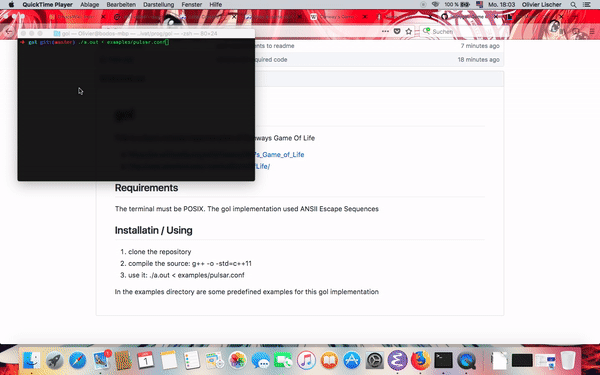

# gol
This is a basic console implemenation of Conways Game Of Life

- https://en.wikipedia.org/wiki/Conway%27s_Game_of_Life
- http://web.stanford.edu/~cdebs/GameOfLife/

## Requirements
The terminal must be POSIX. The gol implementation used ANSII Escape Sequences

## Installatin / Using

1. clone the repository
2. compile the source: g++ -o <output> -std=c++11
3. use it: ./a.out < examples/pulsar.conf

In the examples directory are some predefined examples for this gol implementation

## Example
